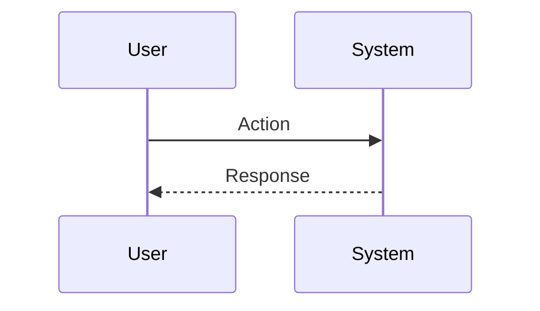

## 1. Context & Problem Statement

<!--
Describe the problem or opportunity this feature addresses.
Why is this important? What user pain point does it solve?
-->

## 2. Proposed Solution (High Level)

<!--
Describe your proposed solution at a high level.
What is the expected behavior?
-->

## 3. Detailed Design (RFC)

### 3.1 Data Structures / Interfaces

<!--
Define key interfaces, types, or data structures.
Use TypeScript or Python type hints.
-->

```typescript
// Example:
interface FeatureConfig {
  enabled: boolean;
  options: FeatureOptions;
}
```

### 3.2 Sequence / Logic Flow

<!--
Describe the flow of data or logic.
Use Mermaid diagrams if helpful.
-->



### 3.3 Error Handling

<!--
What errors can occur? How should they be handled?
-->

## 4. Acceptance Criteria (Testing Strategy)

<!--
Define clear, testable acceptance criteria.
-->

- [ ] **Unit Test**:
- [ ] **Integration Test**:
- [ ] **E2E Test**:

## 5. Alternatives Considered

<!--
What other approaches did you consider? Why were they rejected?
-->

## 6. Dependencies & Risks

<!--
Are there any dependencies on other features or external services?
What are the potential risks?
-->

---

**Checklist before submission:**
- [ ] Title follows format: `feat: <short description>`
- [ ] All sections are filled in English
- [ ] Design is detailed enough for implementation
