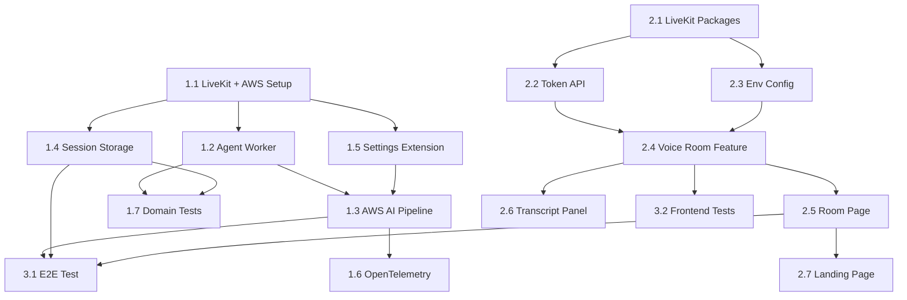

# Phase 1: Implementation Plan

## Overview

This document provides a detailed breakdown of implementation tasks for Phase 1.
Each task is designed to be a single PR with clear scope and acceptance criteria.

### Key Decisions
- **AI Services**: AWS (Transcribe, Bedrock, Polly) instead of LiveKit Inference
- **Language**: Japanese support from Phase 1 (`ja-JP`)
- **Session Storage**: PostgreSQL for metadata and conversation history

---

## Task Breakdown

### Epic 1: Backend Agent Foundation

#### Task 1.1: LiveKit Agents + AWS Setup
**Priority**: P0 | **Estimate**: 2-3 hours

**Description**: Install LiveKit Agents with AWS plugins and configure the development environment.

**Acceptance Criteria**:
- [ ] Dependencies added to `pyproject.toml` (including AWS plugin)
- [ ] `uv sync` completes successfully
- [ ] Model files downloaded via `download-files` command
- [ ] AWS credentials configured
- [ ] Agent can start in console mode

**Implementation Steps**:
```bash
# Add dependencies
cd apps/agent
uv add "livekit-agents[aws,silero,turn-detector]~=1.2"
uv add "livekit-plugins-noise-cancellation~=0.2"
uv add "python-dotenv>=1.0.0"

# Download model files
uv run python -m livekit.agents download-files
```

**Files to Modify**:
- `apps/agent/pyproject.toml`
- `.env.example` (add AWS credentials)

---

#### Task 1.2: Basic Agent Worker
**Priority**: P0 | **Estimate**: 3-4 hours

**Description**: Implement the LiveKit Agent worker that can join a room.

**Acceptance Criteria**:
- [ ] Agent starts and connects to LiveKit
- [ ] Agent appears in LiveKit Cloud dashboard
- [ ] Logs show successful connection
- [ ] Agent responds to room events

**Implementation Steps**:
1. Create `apps/agent/src/adapters/inbound/livekit_worker.py`
2. Implement `EchoSphereAssistant` class
3. Configure `AgentServer` with `@rtc_session` decorator
4. Update `main.py` to use CLI runner

**Files to Create**:
- `apps/agent/src/adapters/inbound/livekit_worker.py`

**Files to Modify**:
- `apps/agent/src/main.py`
- `apps/agent/src/adapters/inbound/__init__.py`

---

#### Task 1.3: AWS AI Pipeline Integration
**Priority**: P0 | **Estimate**: 4-5 hours

**Description**: Integrate AWS AI services (Transcribe, Bedrock, Polly) with AgentSession for Japanese support.

**Acceptance Criteria**:
- [ ] Amazon Transcribe transcribes Japanese speech accurately
- [ ] Amazon Bedrock (Claude 3.5) generates coherent Japanese responses
- [ ] Amazon Polly (Kazuha voice) produces natural Japanese audio
- [ ] Full voice-to-voice pipeline works end-to-end
- [ ] Latency < 2 seconds initially

**Implementation Steps**:
1. Configure AgentSession with AWS services
2. Set Japanese language codes (ja-JP)
3. Add noise cancellation
4. Add turn detection (multilingual model)
5. Test in console mode with Japanese speech

**Key Code**:
```python
from livekit.plugins import aws

session = AgentSession(
    stt=aws.STT(
        language="ja-JP",
        speech_region="ap-northeast-1",
    ),
    llm=aws.LLM(
        model="anthropic.claude-3-5-sonnet-20240620-v1:0",
        region="ap-northeast-1",
        temperature=0.7,
    ),
    tts=aws.TTS(
        voice="Kazuha",  # Japanese neural voice
        speech_engine="neural",
        language="ja-JP",
    ),
    vad=silero.VAD.load(),
    turn_detection=MultilingualModel(),
)
```

**Files to Modify**:
- `apps/agent/src/adapters/inbound/livekit_worker.py`
- `apps/agent/src/config/settings.py`

---

#### Task 1.4: Session Storage (PostgreSQL)
**Priority**: P1 | **Estimate**: 3-4 hours

**Description**: Implement PostgreSQL storage for session metadata and conversation history.

**Acceptance Criteria**:
- [ ] Database schema created (sessions, messages tables)
- [ ] SQLAlchemy models defined
- [ ] Session repository port and adapter implemented
- [ ] Agent stores sessions on start/end
- [ ] Agent stores messages during conversation
- [ ] Docker Compose includes PostgreSQL

**Implementation Steps**:
1. Add SQLAlchemy and asyncpg dependencies
2. Create database models
3. Create Alembic migrations
4. Implement SessionPort interface
5. Implement PostgresSessionAdapter
6. Hook into AgentSession events

**Schema**:
```sql
CREATE TABLE sessions (
    id UUID PRIMARY KEY,
    room_name VARCHAR(255) NOT NULL,
    user_id VARCHAR(255) NOT NULL,
    status VARCHAR(50) NOT NULL DEFAULT 'pending',
    language VARCHAR(10) DEFAULT 'ja-JP',
    started_at TIMESTAMPTZ,
    ended_at TIMESTAMPTZ,
    duration_seconds INTEGER,
    created_at TIMESTAMPTZ DEFAULT NOW()
);

CREATE TABLE messages (
    id UUID PRIMARY KEY,
    session_id UUID REFERENCES sessions(id),
    role VARCHAR(20) NOT NULL,
    content TEXT NOT NULL,
    created_at TIMESTAMPTZ DEFAULT NOW()
);
```

**Files to Create**:
- `apps/agent/src/domain/entities/message.py`
- `apps/agent/src/application/ports/session_repository_port.py`
- `apps/agent/src/adapters/outbound/postgres_session.py`
- `apps/agent/alembic/versions/001_initial.py`

**Files to Modify**:
- `apps/agent/pyproject.toml`
- `docker-compose.yml`

---

#### Task 1.5: Settings Extension for AWS
**Priority**: P1 | **Estimate**: 1-2 hours

**Description**: Extend settings to support AWS and Japanese configuration.

**Acceptance Criteria**:
- [ ] AWS region configurable via environment
- [ ] STT/LLM/TTS models configurable
- [ ] Japanese as default language
- [ ] Agent greeting in Japanese
- [ ] Settings validated at startup

**New Settings**:
```python
# AWS Configuration
aws_region: str = "ap-northeast-1"

# AI Models (AWS)
stt_language: str = "ja-JP"
llm_model: str = "anthropic.claude-3-5-sonnet-20240620-v1:0"
tts_voice: str = "Kazuha"
tts_language: str = "ja-JP"

# Agent Behavior
agent_greeting: str = "こんにちは！エコスフィアです。"
max_response_tokens: int = 256

# Database
database_url: str = "postgresql://..."
```

**Files to Modify**:
- `apps/agent/src/config/settings.py`
- `.env.example`

---

#### Task 1.6: OpenTelemetry Integration
**Priority**: P1 | **Estimate**: 2-3 hours

**Description**: Add distributed tracing for observability.

**Acceptance Criteria**:
- [ ] Traces exported to OTLP endpoint
- [ ] Session lifecycle traced
- [ ] Key latency metrics captured
- [ ] Tracing can be disabled via config

**Implementation Steps**:
1. Create `apps/agent/src/config/tracing.py`
2. Initialize tracer in `main.py`
3. Add span instrumentation to critical paths

**Files to Create**:
- `apps/agent/src/config/tracing.py`

**Files to Modify**:
- `apps/agent/src/main.py`
- `apps/agent/src/config/settings.py`
- `apps/agent/pyproject.toml` (add otel exporter)

---

#### Task 1.7: Domain Layer Tests
**Priority**: P1 | **Estimate**: 2-3 hours

**Description**: Write unit tests for domain entities and services.

**Acceptance Criteria**:
- [ ] Session entity fully tested
- [ ] State transitions validated
- [ ] Edge cases covered
- [ ] Coverage > 80% for domain layer

**Test Cases**:
- Session creation with defaults
- Session state transitions (pending → active → completed)
- Invalid state transition handling
- Duration calculation

**Files to Create**:
- `apps/agent/tests/domain/__init__.py`
- `apps/agent/tests/domain/test_session.py`

---

### Epic 2: Frontend Voice Room

#### Task 2.1: LiveKit Package Installation
**Priority**: P0 | **Estimate**: 1 hour

**Description**: Install LiveKit React components and dependencies.

**Acceptance Criteria**:
- [ ] Packages installed successfully
- [ ] TypeScript types available
- [ ] No peer dependency warnings

**Packages**:
```bash
pnpm add @livekit/components-react livekit-client livekit-server-sdk
pnpm add @livekit/components-styles
```

**Files to Modify**:
- `apps/web/package.json`

---

#### Task 2.2: Token Generation API
**Priority**: P0 | **Estimate**: 2 hours

**Description**: Create Next.js API route for token generation.

**Acceptance Criteria**:
- [ ] POST /api/token returns valid JWT
- [ ] Missing params return 400 error
- [ ] Server misconfiguration returns 500
- [ ] Token has 10-minute TTL

**API Contract**:
```typescript
// Request
POST /api/token
{
  "roomName": "string",
  "participantName": "string"
}

// Response 200
{
  "token": "eyJ..."
}

// Response 400
{
  "error": "Missing roomName or participantName"
}
```

**Files to Create**:
- `apps/web/src/app/api/token/route.ts`

---

#### Task 2.3: Environment Configuration
**Priority**: P0 | **Estimate**: 1 hour

**Description**: Configure frontend environment variables.

**Acceptance Criteria**:
- [ ] NEXT_PUBLIC_LIVEKIT_URL accessible in client
- [ ] Server-only secrets not exposed
- [ ] Type-safe env access

**Files to Create**:
- `apps/web/src/config/env.ts`
- `apps/web/.env.local.example`

**Files to Modify**:
- `apps/web/next.config.ts` (if needed)

---

#### Task 2.4: Voice Room Feature Module
**Priority**: P0 | **Estimate**: 4-5 hours

**Description**: Create the voice-room feature with core components.

**Acceptance Criteria**:
- [ ] VoiceRoom component connects to LiveKit
- [ ] Audio visualizer shows agent state
- [ ] Connection status displayed
- [ ] Graceful error handling

**Components to Create**:
1. `VoiceRoom.tsx` - Main room wrapper
2. `AudioVisualizer.tsx` - BarVisualizer wrapper
3. `ConnectionStatus.tsx` - Connection state indicator

**Files to Create**:
- `apps/web/src/features/voice-room/components/VoiceRoom.tsx`
- `apps/web/src/features/voice-room/components/AudioVisualizer.tsx`
- `apps/web/src/features/voice-room/components/ConnectionStatus.tsx`
- `apps/web/src/features/voice-room/hooks/useVoiceSession.ts`
- `apps/web/src/features/voice-room/types/index.ts`
- `apps/web/src/features/voice-room/index.ts`

---

#### Task 2.5: Room Page Implementation
**Priority**: P0 | **Estimate**: 2-3 hours

**Description**: Create the dynamic room page route.

**Acceptance Criteria**:
- [ ] Page accessible at /room/[roomId]
- [ ] Room name extracted from URL
- [ ] User prompted for name (or use default)
- [ ] Responsive layout

**Route Structure**:
```
/room/[roomId]
  - Extracts roomId from params
  - Prompts for participant name
  - Renders VoiceRoom component
```

**Files to Create**:
- `apps/web/src/app/room/[roomId]/page.tsx`

---

#### Task 2.6: Transcript Panel
**Priority**: P1 | **Estimate**: 3-4 hours

**Description**: Display real-time transcription of conversation.

**Acceptance Criteria**:
- [ ] User speech displayed in real-time
- [ ] Agent speech displayed in real-time
- [ ] Auto-scroll to latest message
- [ ] Visual distinction between speakers

**Implementation**:
- Subscribe to text streams from LiveKit
- Parse transcription events
- Display with speaker attribution

**Files to Create**:
- `apps/web/src/features/voice-room/components/TranscriptPanel.tsx`
- `apps/web/src/features/voice-room/hooks/useTranscript.ts`

---

#### Task 2.7: Landing Page Update
**Priority**: P2 | **Estimate**: 1-2 hours

**Description**: Update home page with room creation form.

**Acceptance Criteria**:
- [ ] Form to enter room name
- [ ] Form to enter participant name
- [ ] Navigation to room page
- [ ] Basic styling with Tailwind

**Files to Modify**:
- `apps/web/src/app/page.tsx`

---

### Epic 3: Integration & Testing

#### Task 3.1: E2E Connection Test
**Priority**: P1 | **Estimate**: 2-3 hours

**Description**: Verify complete flow from frontend to agent.

**Acceptance Criteria**:
- [ ] User can join room from browser
- [ ] Agent joins automatically
- [ ] Audio flows bidirectionally
- [ ] Transcript appears in UI

**Test Procedure**:
1. Start agent in dev mode
2. Open room page in browser
3. Grant microphone permission
4. Speak and verify response
5. Check transcript accuracy

---

#### Task 3.2: Frontend Unit Tests
**Priority**: P1 | **Estimate**: 2-3 hours

**Description**: Write tests for frontend components and hooks.

**Acceptance Criteria**:
- [ ] VoiceRoom component tests
- [ ] useVoiceSession hook tests
- [ ] Token API tests
- [ ] Coverage > 70%

**Files to Create**:
- `apps/web/src/features/voice-room/__tests__/VoiceRoom.test.tsx`
- `apps/web/src/features/voice-room/__tests__/useVoiceSession.test.ts`
- `apps/web/src/app/api/token/__tests__/route.test.ts`

---

## Task Dependencies



---

## Priority Matrix

| Priority | Tasks | Total Estimate |
|----------|-------|----------------|
| P0 (Must Have) | 1.1, 1.2, 1.3, 2.1, 2.2, 2.3, 2.4, 2.5 | 20-26 hours |
| P1 (Should Have) | 1.4, 1.5, 1.6, 1.7, 2.6, 3.1, 3.2 | 16-22 hours |
| P2 (Nice to Have) | 2.7 | 1-2 hours |

**Total Estimate**: 37-50 hours (1.5-2 weeks)

---

## Suggested Execution Order

### Day 1-2: Backend Foundation
1. Task 1.1: LiveKit Agents + AWS Setup
2. Task 1.2: Basic Agent Worker
3. Task 1.5: Settings Extension for AWS

### Day 3-4: AI & Storage Integration
4. Task 1.3: AWS AI Pipeline Integration (Japanese)
5. Task 1.4: Session Storage (PostgreSQL)
6. Task 1.6: OpenTelemetry Integration

### Day 5: Backend Testing
7. Task 1.7: Domain Layer Tests

### Day 6-7: Frontend Foundation
8. Task 2.1: LiveKit Package Installation
9. Task 2.2: Token Generation API
10. Task 2.3: Environment Configuration

### Day 8-9: Voice Room UI
11. Task 2.4: Voice Room Feature Module
12. Task 2.5: Room Page Implementation
13. Task 2.6: Transcript Panel

### Day 10: Polish & Testing
14. Task 2.7: Landing Page Update
15. Task 3.1: E2E Connection Test (Japanese voice)
16. Task 3.2: Frontend Unit Tests

---

## Definition of Done

Each task is considered done when:
- [ ] Code implemented and working
- [ ] Tests written and passing
- [ ] Code reviewed (if applicable)
- [ ] Documentation updated
- [ ] `task check` passes
- [ ] No regression in existing functionality
