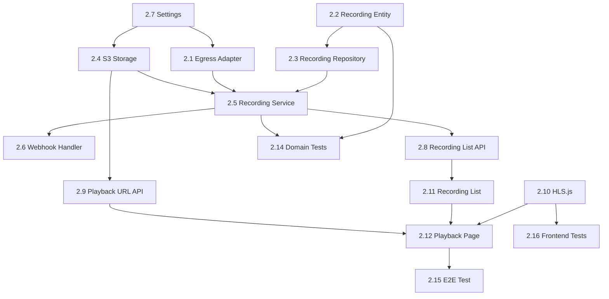

# Phase 2: Recording & Playback Pipeline - Implementation Plan

## Overview

Phase 2 implements the recording and playback pipeline for EchoSphere, enabling users to record voice AI sessions and replay them with synchronized transcript.

### Key Features
- **Auto-recording**: All sessions automatically recorded
- **HLS Streaming**: Adaptive playback using HLS.js
- **Transcript Sync**: Click-to-seek synchronized transcript display
- **30-day Retention**: Cost-effective storage lifecycle

### Architecture Decision
- **Chosen**: Option A - Direct HLS from LiveKit Egress
- **Rationale**: See [ADR-002](../adr/002-recording-pipeline.md)

---

## Technical Architecture

```
┌─────────────────────────────────────────────────────────────────────────┐
│                     Phase 2: Recording Pipeline                          │
├─────────────────────────────────────────────────────────────────────────┤
│                                                                          │
│  ┌──────────────┐     ┌──────────────┐     ┌──────────────────────────┐ │
│  │              │     │   LiveKit    │     │    LiveKit Egress        │ │
│  │   Frontend   │────▶│   Server     │────▶│  (Room Composite)        │ │
│  │  (Next.js)   │     │              │     │                          │ │
│  └──────────────┘     └──────────────┘     └───────────┬──────────────┘ │
│                                                        │                 │
│                                                        │ HLS Segments    │
│                                                        ▼                 │
│  ┌──────────────────────────────────────────────────────────────────┐   │
│  │                        Storage Layer                              │   │
│  │                                                                   │   │
│  │  ┌─────────────┐     ┌─────────────┐     ┌─────────────────────┐ │   │
│  │  │   MinIO     │     │  PostgreSQL │     │   Redis (optional)  │ │   │
│  │  │ (S3-compat) │     │  (metadata) │     │   (job queue)       │ │   │
│  │  └─────────────┘     └─────────────┘     └─────────────────────┘ │   │
│  │                                                                   │   │
│  └──────────────────────────────────────────────────────────────────┘   │
│                                                                          │
│  ┌──────────────────────────────────────────────────────────────────┐   │
│  │                       Playback Layer                              │   │
│  │                                                                   │   │
│  │  ┌─────────────┐     ┌─────────────┐     ┌─────────────────────┐ │   │
│  │  │  HLS.js     │◀────│  Presigned  │◀────│  Recording List     │ │   │
│  │  │  Player     │     │    URLs     │     │      API            │ │   │
│  │  └─────────────┘     └─────────────┘     └─────────────────────┘ │   │
│  │                                                                   │   │
│  └──────────────────────────────────────────────────────────────────┘   │
│                                                                          │
└─────────────────────────────────────────────────────────────────────────┘
```

---

## Database Schema

### New Table: `recordings`

```sql
CREATE TABLE recordings (
    id UUID PRIMARY KEY DEFAULT gen_random_uuid(),
    session_id UUID REFERENCES sessions(id) ON DELETE CASCADE,
    egress_id VARCHAR(255) NOT NULL UNIQUE,

    -- Status tracking
    status VARCHAR(50) NOT NULL DEFAULT 'starting',
    -- Values: starting, active, processing, completed, failed

    -- Storage info
    storage_bucket VARCHAR(255) NOT NULL,
    storage_path VARCHAR(512) NOT NULL,
    playlist_url VARCHAR(1024),  -- Full URL to .m3u8

    -- Metadata
    duration_seconds INTEGER,
    file_size_bytes BIGINT,

    -- Timestamps
    started_at TIMESTAMPTZ,
    ended_at TIMESTAMPTZ,
    created_at TIMESTAMPTZ DEFAULT NOW(),
    updated_at TIMESTAMPTZ DEFAULT NOW()
);

CREATE INDEX idx_recordings_session_id ON recordings(session_id);
CREATE INDEX idx_recordings_egress_id ON recordings(egress_id);
CREATE INDEX idx_recordings_status ON recordings(status);
```

### Messages Table Update

```sql
-- Add timestamp offset for synchronized playback
ALTER TABLE messages ADD COLUMN timestamp_ms INTEGER;
```

### Session Table Update

```sql
ALTER TABLE sessions ADD COLUMN recording_enabled BOOLEAN DEFAULT true;
```

---

## Recording Entity State Machine

```
STARTING → ACTIVE → PROCESSING → COMPLETED
    ↓         ↓          ↓
  FAILED   FAILED     FAILED
```

### State Transitions

| From | To | Trigger |
|------|-----|---------|
| - | STARTING | `start_recording()` called |
| STARTING | ACTIVE | Egress webhook: `egress_started` |
| STARTING | FAILED | Egress API error or timeout |
| ACTIVE | PROCESSING | `stop_recording()` called |
| ACTIVE | FAILED | Egress webhook: `egress_failed` |
| PROCESSING | COMPLETED | Egress webhook: `egress_ended` |
| PROCESSING | FAILED | Egress webhook: `egress_failed` |

---

## Transcript Synchronization

### Data Flow

```
Recording Start → Session start_time recorded
    ↓
Message Created → Calculate offset from start_time
    ↓
timestamp_ms = (message.created_at - session.started_at) in milliseconds
    ↓
Playback → Video currentTime matched with message timestamps
```

### Frontend Sync Logic

```typescript
// Sync transcript with video playback
const SyncedTranscript = ({ messages, videoRef }) => {
  const [currentTime, setCurrentTime] = useState(0);

  useEffect(() => {
    const video = videoRef.current;
    const handleTimeUpdate = () => setCurrentTime(video.currentTime * 1000);
    video.addEventListener('timeupdate', handleTimeUpdate);
    return () => video.removeEventListener('timeupdate', handleTimeUpdate);
  }, []);

  // Find active message based on current time
  const activeIndex = messages.findIndex(
    (msg, i) => {
      const nextMsg = messages[i + 1];
      return msg.timestampMs <= currentTime &&
             (!nextMsg || nextMsg.timestampMs > currentTime);
    }
  );

  return (
    <div className="transcript-panel">
      {messages.map((msg, i) => (
        <TranscriptLine
          key={msg.id}
          message={msg}
          isActive={i === activeIndex}
          onClick={() => videoRef.current.currentTime = msg.timestampMs / 1000}
        />
      ))}
    </div>
  );
};
```

---

## API Contracts

### GET /api/recordings

List all recordings with pagination.

**Request**:
```
GET /api/recordings?page=1&pageSize=20
```

**Response**:
```json
{
  "recordings": [
    {
      "id": "550e8400-e29b-41d4-a716-446655440000",
      "sessionId": "550e8400-e29b-41d4-a716-446655440001",
      "status": "completed",
      "durationSeconds": 300,
      "createdAt": "2024-11-30T10:00:00Z",
      "playbackUrl": "https://..."
    }
  ],
  "total": 10,
  "page": 1,
  "pageSize": 20
}
```

### GET /api/recordings/{id}

Get recording details with transcript.

**Response**:
```json
{
  "id": "550e8400-e29b-41d4-a716-446655440000",
  "sessionId": "550e8400-e29b-41d4-a716-446655440001",
  "status": "completed",
  "durationSeconds": 300,
  "fileSizeBytes": 15000000,
  "createdAt": "2024-11-30T10:00:00Z",
  "startedAt": "2024-11-30T10:00:00Z",
  "endedAt": "2024-11-30T10:05:00Z",
  "playbackUrl": "https://...",
  "transcript": [
    {
      "role": "user",
      "content": "Hello",
      "timestampMs": 500
    },
    {
      "role": "assistant",
      "content": "Hi there! How can I help you today?",
      "timestampMs": 1200
    }
  ]
}
```

---

## Configuration

### New Environment Variables

```bash
# S3/MinIO Configuration
S3_ENDPOINT=http://localhost:9000
S3_ACCESS_KEY=minioadmin
S3_SECRET_KEY=minioadmin
S3_BUCKET_RECORDINGS=echosphere-recordings
S3_REGION=us-east-1

# Egress Configuration
EGRESS_OUTPUT_WIDTH=1280
EGRESS_OUTPUT_HEIGHT=720
EGRESS_SEGMENT_DURATION=4

# Recording defaults
RECORDING_ENABLED_BY_DEFAULT=true
PRESIGNED_URL_EXPIRY_SECONDS=3600
```

---

## Task Breakdown

### Epic 1: Backend Recording Infrastructure (P0)

| Task | Description | Estimate |
|------|-------------|----------|
| 2.1 | Egress Adapter Implementation | 3-4h |
| 2.2 | Recording Domain Entity | 2h |
| 2.3 | Recording Repository + Migration | 2-3h |
| 2.4 | S3 Storage Adapter | 2-3h |
| 2.5 | Recording Service (Use Case) | 3-4h |
| 2.6 | Webhook Handler for Egress Events | 2-3h |
| 2.7 | Settings Extension | 1-2h |

### Epic 2: Backend API Layer (P0)

| Task | Description | Estimate |
|------|-------------|----------|
| 2.8 | Recording List API | 2-3h |
| 2.9 | Recording Playback URL API | 1-2h |

### Epic 3: Frontend Playback Feature (P0)

| Task | Description | Estimate |
|------|-------------|----------|
| 2.10 | HLS.js Integration | 2-3h |
| 2.11 | Recording List Page | 2-3h |
| 2.12 | Playback Page with Transcript Sync | 3-4h |
| 2.13 | Recording Toggle in Voice Room | 1-2h |

### Epic 4: Integration & Testing (P1)

| Task | Description | Estimate |
|------|-------------|----------|
| 2.14 | Recording Domain Tests | 2-3h |
| 2.15 | E2E Recording Flow Test | 2-3h |
| 2.16 | Frontend Tests | 2-3h |

---

## Task Dependencies



---

## Suggested Execution Order

### Week 1: Backend Foundation
1. Task 2.7: Settings Extension
2. Task 2.2: Recording Domain Entity
3. Task 2.3: Recording Repository + Migration
4. Task 2.1: Egress Adapter
5. Task 2.4: S3 Storage Adapter
6. Task 2.5: Recording Service

### Week 2: API & Frontend
7. Task 2.6: Webhook Handler
8. Task 2.8: Recording List API
9. Task 2.9: Playback URL API
10. Task 2.10: HLS.js Integration
11. Task 2.11: Recording List Page
12. Task 2.12: Playback Page
13. Task 2.13: Recording Toggle

### Week 3: Testing & Polish
14. Task 2.14: Domain Tests
15. Task 2.15: E2E Test
16. Task 2.16: Frontend Tests

---

## Files to Create

### Backend
| File | Purpose |
|------|---------|
| `apps/agent/src/domain/entities/recording.py` | Recording entity with state machine |
| `apps/agent/src/domain/value_objects/egress_config.py` | Egress configuration value object |
| `apps/agent/src/application/ports/egress_port.py` | Egress service interface |
| `apps/agent/src/application/ports/recording_repository_port.py` | Recording repository interface |
| `apps/agent/src/application/ports/storage_port.py` | S3 storage interface |
| `apps/agent/src/application/use_cases/recording_service.py` | Recording lifecycle management |
| `apps/agent/src/adapters/outbound/livekit_egress.py` | LiveKit Egress API adapter |
| `apps/agent/src/adapters/outbound/postgres_recording.py` | Recording repository implementation |
| `apps/agent/src/adapters/outbound/s3_storage.py` | S3/MinIO storage adapter |
| `apps/agent/src/adapters/inbound/egress_webhook.py` | Webhook handler for egress events |
| `apps/agent/alembic/versions/002_add_recordings.py` | Database migration |

### Frontend
| File | Purpose |
|------|---------|
| `apps/web/src/features/recording-player/components/VideoPlayer.tsx` | HLS video player |
| `apps/web/src/features/recording-player/components/RecordingList.tsx` | Recording list display |
| `apps/web/src/features/recording-player/components/PlaybackView.tsx` | Full playback UI |
| `apps/web/src/features/recording-player/components/SyncedTranscript.tsx` | Synchronized transcript |
| `apps/web/src/features/recording-player/hooks/useHlsPlayer.ts` | HLS.js integration hook |
| `apps/web/src/features/recording-player/api/recordings.ts` | API client for recordings |
| `apps/web/src/app/recordings/page.tsx` | Recording list page |
| `apps/web/src/app/recordings/[id]/page.tsx` | Playback page |

---

## Definition of Done

Each task is complete when:
- [ ] Code implemented and working
- [ ] Unit tests written and passing
- [ ] Integration tested locally
- [ ] `task check` passes
- [ ] Documentation updated (if API changes)
- [ ] PR created with clear description
